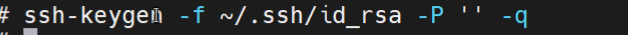

# 📦 cross-platform-backup

A cross-platform file sharing and automated backup system using **NFS**, **Samba**, and **rsync**.

---

## 🔧 Architecture Overview

The system allows Linux clients to mount directories via NFS and Windows clients to access shared files via Samba. Real-time synchronization between directories is achieved using rsync + inotify.


---

## 🖥️ Environment Requirements

- CentOS / Rocky Linux 8+
- NFS server and client tools
- rsync + inotify-tools
- Samba (for Windows access)



---

## 📁 NFS Server & Client Setup

### 1. Server Side (node2)

Export `/export/software` using `/etc/exports`:

```bash
/export/software *(rw,sync,no_root_squash)

Start and enable NFS service:


systemctl enable --now nfs-server
2. Client Side (node1)
Mount NFS share:


mount -t nfs node2:/export/software /export/software

🔁 Real-time File Sync via rsync
1. rsyncd Configuration (on target node):
/etc/rsyncd.conf


uid = root
gid = root
use chroot = no
max connections = 5
log file = /var/log/rsyncd.log
[backup]
    path = /export/properties
    comment = Backup Directory
    read only = no
    auth users = backup_user
    secrets file = /etc/rsyncd.passwd

2. Client Script Example (based on inotify):

#!/bin/bash
SOURCE_DIR="/export/software"
TARGET_DIR="backup_user@192.168.88.3::backup"
LOG_FILE="/var/log/rsync_realtime.log"

inotifywait -m -r -e modify,create,delete,move "${SOURCE_DIR}" | while read path action file; do
    echo "Detected ${action} on ${file}, syncing..."
    rsync -avz --password-file=/etc/rsync.pass "${SOURCE_DIR}/" "${TARGET_DIR}" >> "$LOG_FILE" 2>&1
done
3. Sample Log Output

🪟 Windows File Sharing via Samba
1. smb.conf Configuration Example:

[global]
    workgroup = WORKGROUP
    security = user
    map to guest = Bad User

[smbshare_software]
    path = /export/software
    browsable = yes
    writable = yes
    guest ok = yes

2. On Windows
a) Add Network Location
Go to "This PC" > "Add a network location" > \\192.168.88.102\smbshare_software


b) After Mapping Success
Samba share will show in File Explorer:
