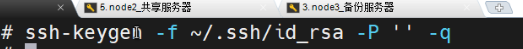

# 🔄 Cross-Platform Backup System

A cross-platform file sharing and automated backup system using **NFS**, **rsync**, and **Samba**, designed to sync data between Linux servers and provide access from Windows clients.

---

## 🧱 System Architecture

This system enables:

- Real-time file synchronization between two Linux servers using `inotify + rsync`
- File sharing to Windows clients via Samba




---

## ⚙️ Requirements

The following tools are required on both Linux nodes:

- `nfs-utils`
- `samba`
- `rsync`
- `inotify-tools`

Install them using:

```bash
yum install -y nfs-utils samba rsync inotify-tools
requirements.png


